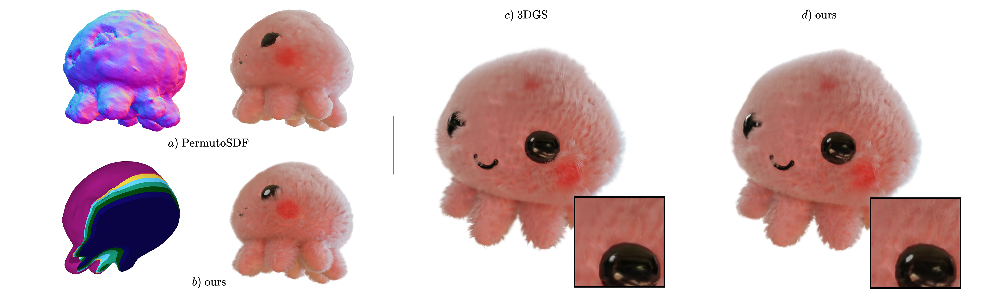

# Volumetric Surfaces (CVPR 2025)

### Representing Fuzzy Geometries with Layered Meshes

### [Project Page](https://s-esposito.github.io/) | [Paper](https://arxiv.org/abs/2409.02482) | [Web Demo](https://s-esposito.github.io/volsurfs/viewer/)


[Stefano Esposito](https://s-esposito.github.io/)<sup>1</sup>,
[Anpei Chen](https://apchenstu.github.io/)<sup>1</sup>, 
[Christian Reiser](https://creiser.github.io/)<sup>1</sup>, 
[Samuel Rota Bulò](https://scholar.google.com/citations?user=484sccEAAAAJ&hl=it)<sup>2</sup>, 
[Lorenzo Porzi](https://scholar.google.it/citations?user=vW1gaVEAAAAJ&hl=it)<sup>2</sup>, 
[Katja Schwarz](https://katjaschwarz.github.io/)<sup>2</sup>, 
[Christian Richardt](https://richardt.name/)<sup>2</sup>, 
[Michael Zollhöfer](https://zollhoefer.com/)<sup>2</sup>, 
[Peter Kontschieder](https://scholar.google.co.uk/citations?user=CxbDDRMAAAAJ&hl=en)<sup>2</sup>,
[Andreas Geiger](https://www.cvlibs.net/)<sup>1</sup>
<br>
<sup>1</sup>[University of Tübingen](https://uni-tuebingen.de/fakultaeten/mathematisch-naturwissenschaftliche-fakultaet/fachbereiche/informatik/lehrstuehle/autonomous-vision/home/), <sup>2</sup>Meta Reality Labs

```
⚠️ This code release has not been finalized yet. Some components might not work as intended.
```

<p align="middle">
  
</p>

## Install 

```bash
# recursive cloning
git clone --recursive https://github.com/s-esposito/volsurfs_dev

# create environment
conda create -n volsurfs python=3.8
conda activate volsurfs

# install cuda toolkit
conda install -c "nvidia/label/cuda-11.8.0" cuda-toolkit

# install torch
conda install pytorch==2.1.0 torchvision==0.16.0 torchaudio==2.1.0 pytorch-cuda=11.8 -c pytorch -c nvidia

# install tiny cuda nn
pip install git+https://github.com/NVlabs/tiny-cuda-nn/#subdirectory=bindings/torch

# install mvdatasets (volsurfs branch)
pip install submodules/mvdatasets

# install raytracelib (volsurfs branch)
pip install submodules/raytracelib

# install permutohedral encoding
make -C submodules/permutohedral_encoding

# install remaining requirements
pip install -r requirements.txt

# install APEX
pip install submodules/apex -v --disable-pip-version-check --no-cache-dir --no-build-isolation --config-settings "--build-option=--cpp_ext" --config-settings "--build-option=--cuda_ext" ./

# (optional) install cmake 
conda install anaconda::cmake 

# finally, install volsurfs
pip install -e .
```

## Datasets

For training and experiments we use the the [NeRF_Synthetic](scripts/download/blender.sh), [DTU](scripts/download/dtu.sh) and [Shelly](scripts/download/shelly.sh) datasets. Downloading scripts in `scripts/download` will download the each dataset in `data`.

```bash
    data
    ├── shelly
    │   ├── khady
    │   ├── kitten
    │   └── ...
    ├── dtu
    │   ├── dtu_scan24
    │   ├── dtu_scan37
    │   └── ...
    ├── blender
    │   ├── lego
    │   └── ...
    └── ...
```

## Reproduce results

To reproduce paper results (5-Mesh) on [Shelly](scripts/download/shelly.sh), run the `scripts/train_all_shelly.sh` script. Make sure you set the right paths in `config/paths_config.cfg` before. [Wandb](https://wandb.ai/) logging is active by default, you can toggle it in `config/train_config.cfg`.

## License

This project is licensed under the Creative Commons Attribution 4.0 International License (CC BY 4.0). See the [LICENSE](LICENSE) file for details.

You are free to use, modify, and distribute this code as long as you provide proper attribution to the original author(s).

## Citation

If you use this library for your research, please consider citing:

```bibtex
@inproceedings{Esposito2025VolSurfs,
  author    = {Esposito, Stefano and Chen, Anpei and Reiser, Christian and Rota Bulò, Samuel and Porzi, Lorenzo and Schwarz, Katja and Richardt, Christian and Zollhoefer, Michael and Kontschieder, Peter and Geiger, Andreas},
  title     = {Volumetric Surfaces: Representing Fuzzy Geometries with Layered Meshes},
  booktitle = {IEEE/CVF Conference on Computer Vision and Pattern Recognition (CVPR)},
  year={2025}
}
```

```bibtex
@misc{Esposito2025MVD,
  author       = {Esposito, Stefano and Geiger, Andreas},
  title        = {MVDatasets: Standardized DataLoaders for 3D Computer Vision},
  year         = {2025},
  url          = {https://github.com/autonomousvision/mvdatasets},
  note         = {GitHub repository}
}
```

## Acknowledgement

This repo is based on [Radu Alexandru Rosu](https://radualexandru.github.io/)'s [permuto_sdf](https://github.com/RaduAlexandru/permuto_sdf). We thank him for his amazing work.